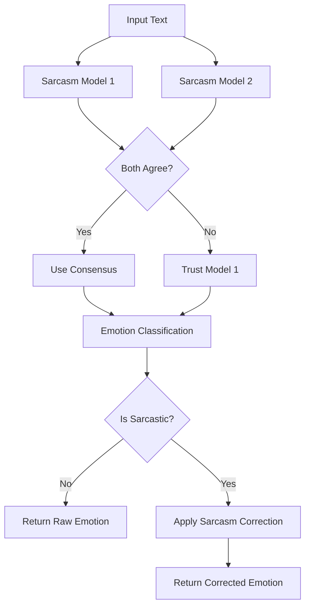

# Shapes of Mind ML Classifier

A sophisticated **3-model hybrid pipeline** for sarcasm-aware emotion classification. This system combines dual sarcasm detection with advanced emotion classification to provide contextually accurate emotional analysis.

## 🧠 Architecture

### **3-Model Hybrid Pipeline:**

1. **🎭 Sarcasm Detection Model #1** (Primary): [`bharatiyabytes/flan-t5-sarcasm`](https://huggingface.co/bharatiyabytes/flan-t5-sarcasm)
2. **🎭 Sarcasm Detection Model #2** (Ensemble): [`AventIQ-AI/Sarcasmdetection`](https://huggingface.co/AventIQ-AI/Sarcasmdetection)  
3. **😊 Emotion Classification**: [`SamLowe/roberta-base-go_emotions`](https://huggingface.co/SamLowe/roberta-base-go_emotions)

### **🔄 Processing Logic:**



## ✨ Features

- **🎭 Dual Sarcasm Detection**: Ensemble approach for robust sarcasm identification
- **😊 27+ Emotion Classification**: Based on Google's GoEmotions dataset
- **🔄 Sarcasm-Aware Correction**: Intelligent emotion reinterpretation for sarcastic content
- **📊 Batch Processing**: Efficient analysis of multiple texts
- **🔍 Detailed Analysis**: Comprehensive JSON output with confidence scores
- **💬 Interactive Testing**: Real-time text analysis interface

## 🚀 Setup

### 1. Create Virtual Environment

```bash
# Create virtual environment using pyenv
pyenv virtualenv 3.11 shapes-of-mind
pyenv activate shapes-of-mind
```

### 2. Install Dependencies

```bash
pip install -r requirements.txt
```

## 📖 Usage

### Basic Analysis

```python
from shapes_of_mind_classifier import ShapesOfMindClassifier

# Initialize the classifier
classifier = ShapesOfMindClassifier()

# Analyze text
result = classifier.analyze("Oh great, another Monday morning!")
print(result['final_emotion'])  # 'anger' (corrected from 'joy')
```

### Complete Analysis

```python
# Get detailed analysis
result = classifier.analyze("I just LOVE waiting in traffic!", verbose=True)

# JSON output structure:
{
  "text": "I just LOVE waiting in traffic!",
  "is_sarcastic": true,
  "sarcasm_confidence": "high",
  "raw_emotions": [
    {"label": "joy", "score": 0.85},
    {"label": "optimism", "score": 0.12},
    ...
  ],
  "final_emotion": "anger",  # Corrected due to sarcasm
  "correction_applied": true
}
```

### Batch Processing

```python
texts = [
    "I love this new policy!",        # Could be sarcastic
    "This weather is perfect.",       # Could be sarcastic  
    "I'm genuinely excited!"          # Likely genuine
]

results = classifier.batch_analyze(texts, verbose=True)
```

## 🧪 Testing

### Run Test Suite
```bash
python test_shapes_classifier.py
```

### Interactive Testing
```bash
python test_shapes_classifier.py
# Choose 'y' for interactive mode
```

### Demo
```bash
python shapes_of_mind_classifier.py
```

## 🎯 Model Information

### **Sarcasm Detection Models**
- **Primary**: `bharatiyabytes/flan-t5-sarcasm` (Text-to-text generation)
- **Secondary**: `AventIQ-AI/Sarcasmdetection` (Classification)

### **Emotion Classification Model**  
- **Model**: `SamLowe/roberta-base-go_emotions`
- **Base**: RoBERTa-base
- **Emotions**: 27+ emotions from Google's GoEmotions dataset
- **Training**: 58k carefully curated comments

### **Sarcasm Correction Rules**
When sarcasm is detected, specific emotions are reinterpreted:

| Original Emotion | Corrected Emotion | Reasoning |
|-----------------|------------------|-----------|
| joy, optimism, gratitude | anger | Positive emotions often inverted in sarcasm |
| neutral, approval | annoyance | Mild emotions become irritation |
| admiration, excitement | anger | Enthusiastic emotions become frustration |

## 📁 Files

- `shapes_of_mind_classifier.py` - Main hybrid classifier implementation
- `test_shapes_classifier.py` - Comprehensive test suite
- `requirements.txt` - Python dependencies  
- `README.md` - This documentation

## 🔧 Requirements

- **Python**: 3.8+
- **PyTorch**: 2.0+
- **Transformers**: 4.21+
- **NumPy**: 1.21+
- **SciPy**: 1.9.0+
- **Scikit-learn**: 1.1.0+

## 📊 Performance Notes

- **First Run**: Downloads ~800MB of models (cached locally)
- **GPU Support**: Automatic CUDA detection and utilization
- **Processing Speed**: ~200-500ms per text (CPU), ~50-100ms (GPU)
- **Memory Usage**: ~2-3GB RAM for all three models

## 🎯 Use Cases

- **Social Media Analysis**: Detecting sarcasm in tweets, comments
- **Customer Feedback**: Understanding true sentiment behind reviews  
- **Content Moderation**: Identifying disguised negative sentiment
- **Market Research**: Analyzing authentic vs. sarcastic responses
- **Chatbot Training**: Improving response appropriateness

## 🔬 Example Outputs

```python
# Sarcastic text
"Oh wonderful, another software update!" 
→ Sarcasm: True | Final: anger (was joy)

# Genuine text  
"I'm genuinely excited about this project!"
→ Sarcasm: False | Final: joy (unchanged)

# Ambiguous text
"This is totally fine."
→ Sarcasm: depends on models | Final: varies
```

## 📄 License

This implementation is provided as-is. Please refer to the original models' licenses on Hugging Face.

## 🙏 Acknowledgments

- **bharatiyabytes** for the FLAN-T5 sarcasm detection model
- **AventIQ-AI** for the ensemble sarcasm detection model  
- **SamLowe** for the GoEmotions RoBERTa implementation
- **Google Research** for the original GoEmotions dataset
